--- 
title: "Introduction to Batch Tipsy Composer"
author: "Dave Waddell, RPF, MF"
date: "2023-03-02"
site: bookdown::bookdown_site
description: |
  This is the bookdown for Intro to BTC
  The HTML output format for this example is bookdown::gitbook,
  set in the _output.yml file.
---

# Introduction 

Batch Tipsy Composer (BTC) has been around since the first production runs of the MSYTs for TSR.  It initially provided an efficient CSV interface that got around the strict and old school format specification for the batch version of Tipsy.  

While many of you are probably familiar with the Tipsy 4.4 and 4.5, BTC has a much different interface.  

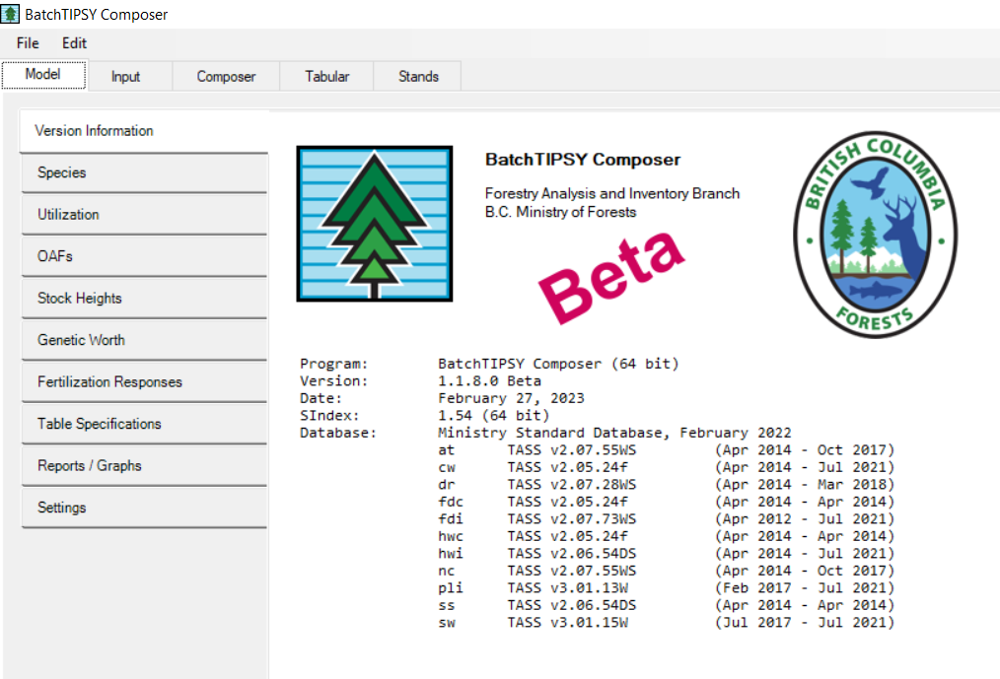

Please not that this is version 1.1.8.0 BETA, February 27, 2023.  

The intent is to have this product ready for general release sometime this spring.  

So for now, use wisely.....

# BTC and example inputs

The BETA version of BTC is available here: 

G:/!Transfr/MSYT_Delivery/BatchTipsy

Copy to your local drive c:/data/localapps

- BTC20230227.zip

Unzip just the BTC component  

Also grab the sample data file

- MSYT_sample.csv

# Model Tab 

The Model tab opens when BTC is instantiated and allows the user to specify a number of options.  In general, the interface has been tailored for TSR use in terms of preset defaults, but it is always good practice to check and see what is turned on and what is turned off.  It may surprise you and we don't want that. 

## Species

Ignore this for now.  This is hard wired.  
It simply lists the species codes that BTC recognizes.    

The Species that the MSYT process uses will dealt with in another session.  

## Utilization

The default show be set to TSR utilization specifications.  

The default should be: Everything 17.5 except Interior Pl and Coast Old Growth 12.5

This can be interpreted as:

- Interior Pl: 12.5
- Interior Other Species: 17.5
- Coast: All species 12.5

- Deciduous Interior : 17.5
- Deciduous Coast: 12.5

**THIS SECTION IS UNDER REVISION FOR CLARITY. **

## OAFs

BTC has a variety of OAFs that are user selectable:

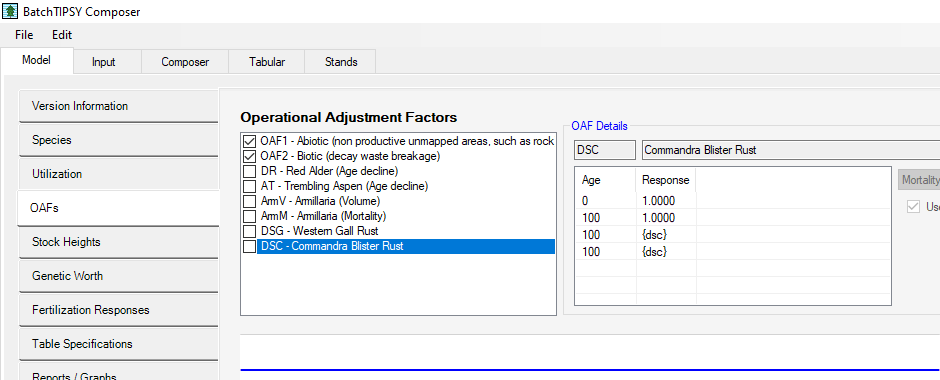

In our case, we will be using the following:

- OAF1
- OAF2
- DR
- AT

The other OAFs:

- AmV
- AmM
- DSG
- CSC

require local information and are not normally used.  

We are using the OAFS provided for Alder (DR) and Aspen (AT).  Note that in the volume output tables, you will notice the decline in deciduous volume.  

### DR OAF

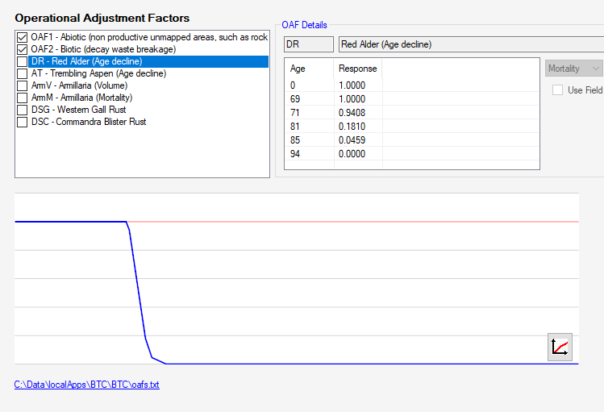

### AT OAF

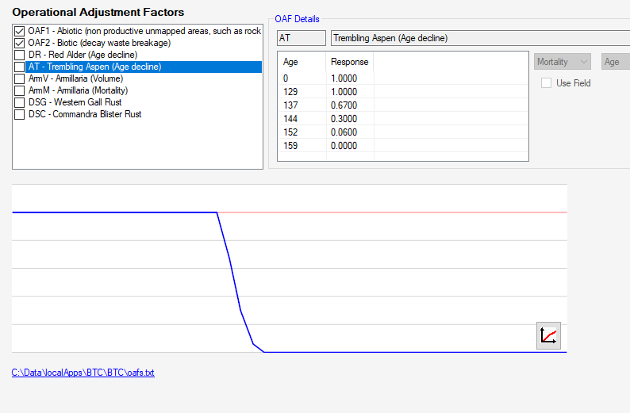

**THIS SECTION IS UNDER REVISION FOR CLARITY. **

## Stock Height

not used

## Genetic Worth

This is overwritten by the 5 genetic worth columns in the input table.  
(or at least it had better be)

## Fertilization Response

not used

## Table Specifications

BTC tables are capped at age = 120.  This was a group decision that included the Stand Development Modelling group, the YSM group and TSR folk.  

The default setting for BTC should be: 

0-120:10|# MAX=120 INC=10

So stands are capped at 120 years and the age increment is 10.

Note that if input is selected to be TSR MSYT input format, then this is automattically the setting.  

**THIS SECTION IS UNDER REVISION FOR CLARITY. **

## Reports / Graphs

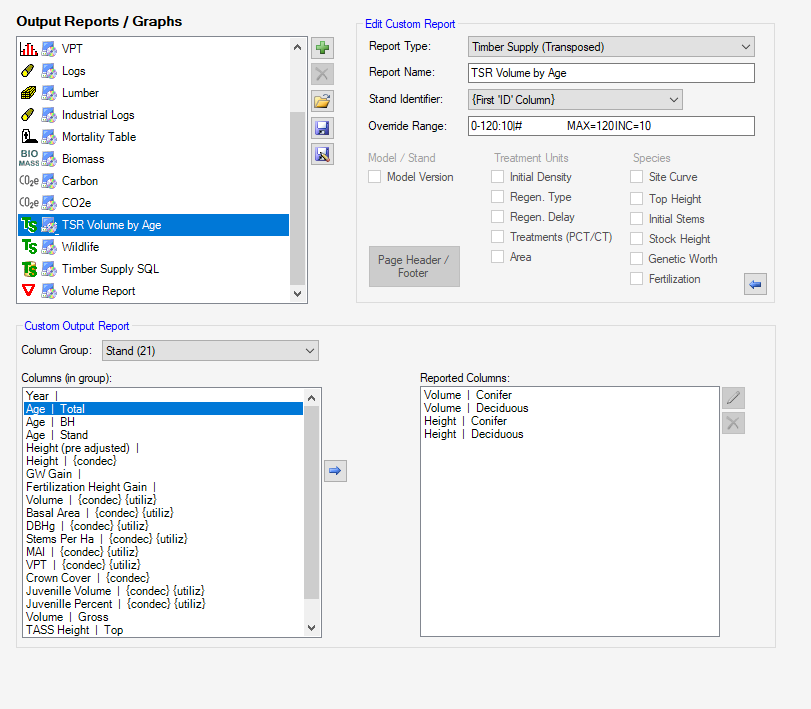

This section details all the information that CAN be reported on.   
For standardized MSYTs, only volumes and heights are reported by age.

## Settings

ignore

# Input Tab

The next main tab is the Input tab,  This tab allows the user to select the type if format for the input tables.  In the case of TSR, we use a very specific format that is represented in a CSV file.  

## Overview of Input

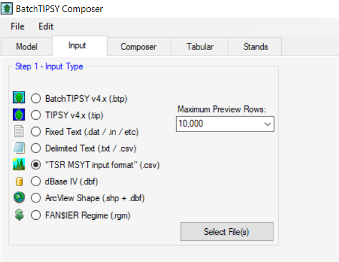

Once you have selected the TSR MSYT input format (csv) you may encounter 2 pop up boxes:

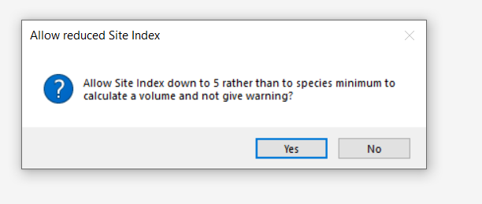

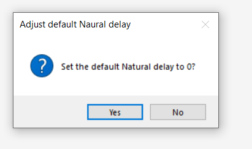

Click yes to both of these.  We are sorting these out.  

There is no such thing as natural delay. 

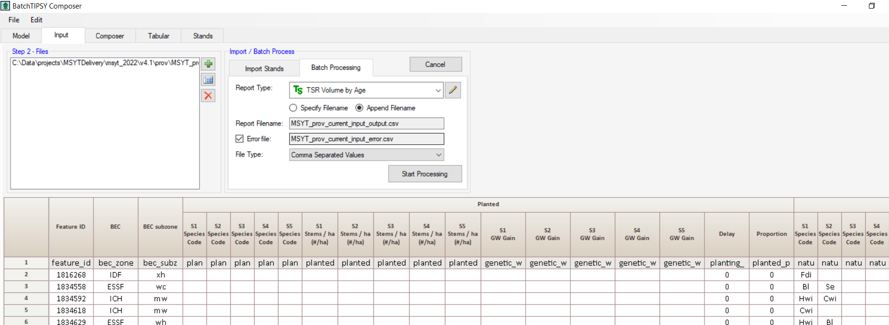

Once you have selected your input file the first few rows will appear.  It is important to note that there are 4 main sections to each input row:

## Identifier Section

The first section supplies the row identifier (in this case feature_id), as well as the BEC zone and subzone.  
Note that BTC has a know list of BEC and if supplied with something unknown an ERROR will occur.

The first column in the CSV is always the name of the identifier.  Accepted values:

- feature_id
- opening_id
- id 

## Planted Composition

The second section represents the planted component of the stand and shows:

- Planted Species (1-5)
- Planted Species Density (1-5)
- Genetic Worth by species (1-5)
- Planting Delay
- Percent Planted (0-100)

## Natural Composition

The third section represents the natural component of the stands and shows:

- Natural Species (1-5)
- Natural Species Density (1-5)

## Other attribution

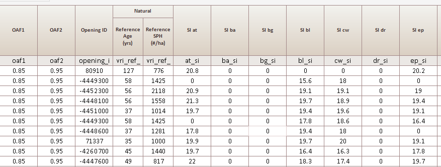

The fourth section shows:

- OAF1
- OAF2
- Opening_id (optional) 

  
  
- vri reference age (for pre 1987 stands)
- vri ref density (for pre 1987 stands)  

 
- Site Index values for all 22 PSPL species

### special identifiers

- vri reference age (for pre 1987 stands)
- vri ref density (for pre 1987 stands)  

These only apply to stands harvested prior to 1987.  

# Different from Tipsy 4.5 

Tipsy in general allows for the blending of individual stand components.  An example would be a stand that has a 50/50 mix of Fir and spruce.  Tipsy will generate a pure Fir curve and a pure Spruce curve and then blend them together using a 50/50 mix.  

BTC differs from previous versions of generic TIPSY.  It allows for:

- simplified and more efficient method(s)  for initial stand inputs
- blending planted and natural species (weighted/controlled by an input attribute)

# The GO Button

Well BTC doesn't actually have button called go, but there is once called Start Processing.

# BTC Input Example

Consider the following stand description:

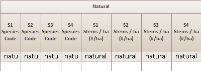
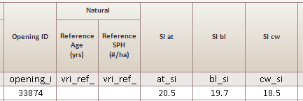

This shows a 100% planted stand, with the natural component all NULL.

You can have a 100% planted stand with the natural component being NON NULL.  
Because the planted % = 100, BTC will ignore the natural component.  

Note that a species site index is required for each species in the valid species composition, otherwise an ERROR message. 

# BTC output

## General

Note at the bottom that it lists the Error File  
with Warnings and Errors.  

In this case there were none.  

Output is single row per identifier,  with:

- merch conifer volume (MVcon_) at age 0-120
- merch deciduous volume (MVdec_) at age 0-120
- conifer height (HTcon_) at age 0-120
- deciduous height (HTdec_) at age 0-120

In a single row.   

## Height

Note about height.  

Is the height output from Tipsy the average height?  

The short answer is yes.   

Height is supposed to be the “top” 100 trees, predominant…   
which used to be tallest and now is fattest?    
Of course we don’t have individual trees in TIPSY.    
One of the problem comes when we OAF the deciduous.   

But the graphs can be a bit strange now.  

Testing  PLI 70% and AT 30%.  
At 158yrs (DR happens at 70) the OAF=0 so the height suddenly goes away.  
Switch from ht of pine * 0.7 + ht of aspen * 0.3  to just ht of pine.  

# BTC Errors & warnings

I have deleted one of the se_si values where Se is in the species composition.

And if we look at the error file:

There are three lines documenting the error:

    Error	2:48:11	No direct Site Index	
    The treatment unit 'Planted' doesn't contain either;  
    an Age/Height pair, a User Site Index, or a Provincial Productivity Site Index

    Warning	2:48:11	Species Missing Provincial Site Productivity	 
    This species Is missing a Provincial Site Productivity site index!	
    Se 

    Warning	2:48:11	Site Index for 'Poor' Site Class	
    SI not entered, calculated from POOR Site class	Se

The last message is warning us that BTC tried to find an alternative site index from poor site class for Se but couldn't find one.  

It is best to provide everything that BTC needs and avoid going to default site index values. 

Changing one of the Se planted densities to 8000 gives these warnings:

    Warning	3:02:27	Reduced Stems/ha	8,000 using max available of 4,444	Se
    Warning	3:02:27	Reduced Stems/ha	8,000 using max available of 4,444	Se

There are warnings for:

- site index too high
- site index too low
- exceeding maximum density for a species
- going below the minimum density for a species

In theory, for the Provincial release, there should be no errors and the warnings have been examined and accounted for.  

High site, the site index gets capped at the max allowed.  
Reduced stems, means we’re using the max stems available in the database

Low site if you get a warning, the species won’t be contributing any volume.

# Supplemental

## Planting Delay

Planting Delay is defined as the time lag between harvest and planting.

RESULTS data provide both the harvest data and the planting date for an opening.

In the case where there are multiple events of either type, the largest earliest is chosen.

Planting Delay = Planting year - Harvest Year (for the opening)

The age of the stock (generally assumed to be 1) is subtracted from the planting delay, but the planting delay is NOT allowed to go below zero.

The planting delay is then used as an input to TIPSY where it has the effect of shifting the MSYT to the right along the x axis.

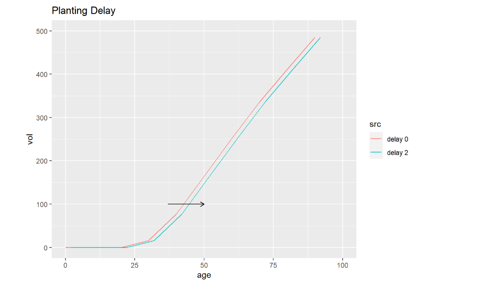

It should be noted that the provincial average for the time between disturbance and planting is on the order of 18 months.

It should also be noted that the stock age across the province is 1. This comes from Seed Planning and Registry (SPAR) sowing requests tabulated by Sabrina Donnelly RPB, 2021.

## Natural Stand Initiation

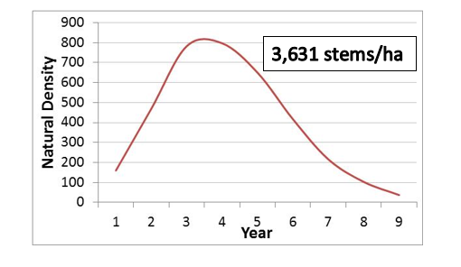

- distribution: poisson
- lambda: 3.2
- max: 9
- height vigour: off 

The max shown is 9, but this will depend on the initial density.   

 

